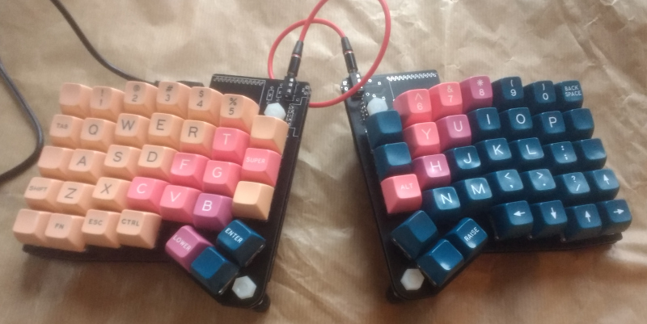

# ErgoSnap Keyboard

WARNING. This is rev1.1, which works fine but has a few issues:

 - The silkscreen for the ProMicro outline is incorrect for the USB-up placement
 - USB cable only just plugs into the ProMicro on the left half (plug shroud is
   against the edge of the PCB below the ProMicro)
 - SDA & SCL are the wrong way around on the 5pin header for the Pimoroni
   trackball breakout, so that doesn't work without some jumper wires...

[ErgoDash][1] layout with [Mitosis][2] style PCB construction, reversible ProMicro
chin from [Ergo42][3].

 - Removed all the wiring for backlight/underlight LEDs
 - Uses through-switch diode holes
 - M6 mouting holes on the "inside" board edges for tenting
 - 5 pin connector for [trackball module][4] (no software yet...)

[1]: https://github.com/omkbd/ErgoDash
[2]: https://github.com/reversebias/mitosis-hardware
[3]: https://github.com/Biacco42/Ergo42
[4]: https://shop.pimoroni.com/products/trackball-breakout

## Fabrication

I got my PCBS made at [JLCPCB][5]. No issues.

[5]: https://jlcpcb.com/

## Build

See [build guide](build_guide/).

## License

ErgoDash & Ergo42 are MIT, Mitosis is GPLv3. So this work as a whole is GPLv3.
