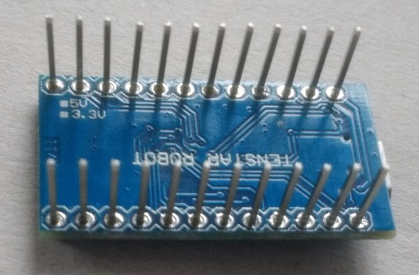
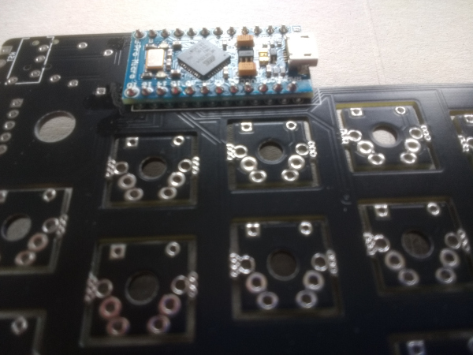
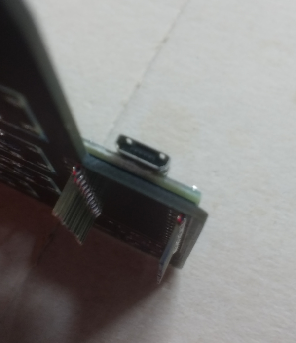
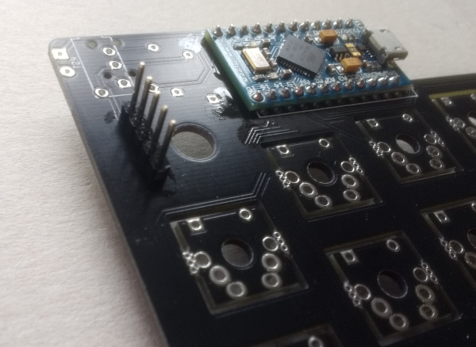
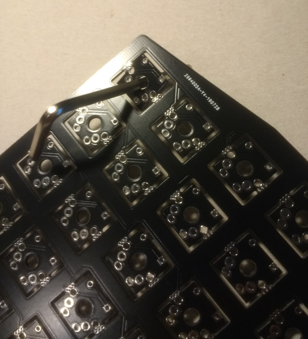
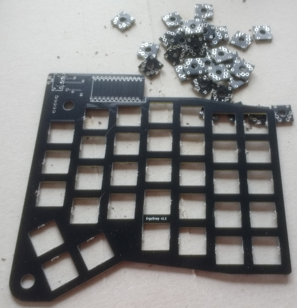
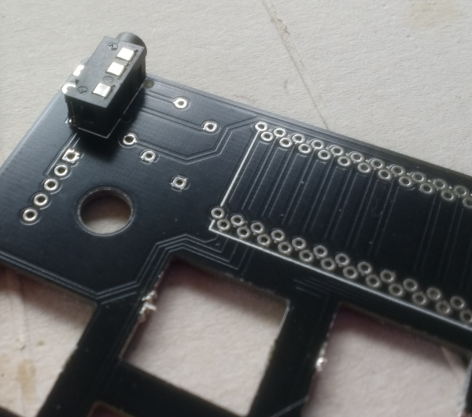
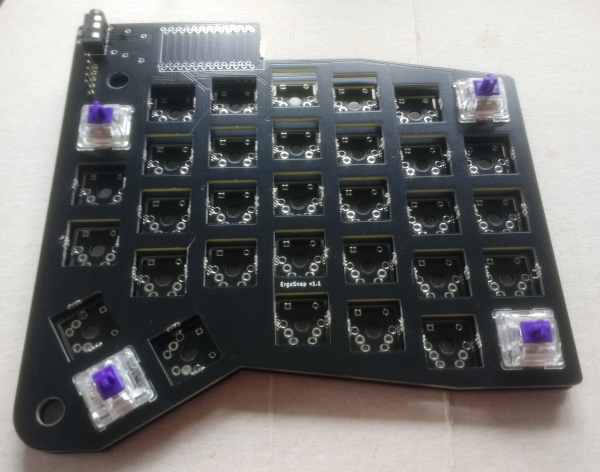
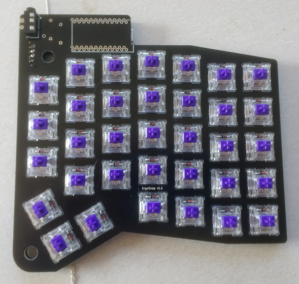

# Build Guide

Each half of the keyboard is made up of two boards, bottom and top.

The pictures in this guide are all of the *right* hand half, everything is
mirrored on the left half.

## Bottom board

Solder headers onto the ProMicro. I snip the headers into chunks of 4 before
soldering as you'll want to pull the plastic spacer off after soldering and that
makes it easier.

Now solder the ProMicro onto the board. This will be your bottom board. The
silkscreen is incorrect - don't align the ProMicro with the outline. Check the
RST pin is connected to the reset header on the board edge and the GND pins are
in the right place. Make sure you get the ProMicro flush against the board as
the space it fits into between the two boards is quite tight.

Solder a 5 pin header on

On **one half only**, solder on the two i2c pullup resistors behind the
ProMicro.

### For switches without diode holes (e.g. normal Cherry MX)

Solder diodes onto the *bottom* of the PCB. Make sure the leg from the side of
the diode with a black stripe goes to the square pad! All the black stripes
should be towards the "inside" edge of the board (that's the left side for the
right half and the right for the left half). Use flush cutters to trim the legs
(sticking out of the top of the board) as flush as possible - make sure that a
switch can sit flat on top of the soldered legs.

## Top Board

Snap out all the keyswitch footprints.

Get a screwdriver or something (I've used an allen key here) that fits in the
center keyswitch mounting hole and rock it back and forward until the footprint
detaches. Repeat for them all. Once they are all out go round and clean up the
snapped-off sections a bit.

Solder on the TRRS jack.

Solder on the keyswitches. I started by aligning four in the corners to make
sure everything was lined up.

Solder the five pin header onto the top board (this passes the power and I2C
pins through to the TRRS jack).

### For switches with diode holes (e.g. Zealios)

Place the diodes, legs go through the holes in the top of the switches and out
of the bottom next to the switch pins. Make sure the leg from the side of the
diode with a black stripe goes to the square pad! All the black stripes should
be towards the "inside" edge of the board (that's the left side for the right
half and the right for the left half). Solder in the diodes, making sure they
are pulled through reasonably tightly so that the diode sits against the switch
and isn't sticking up.

